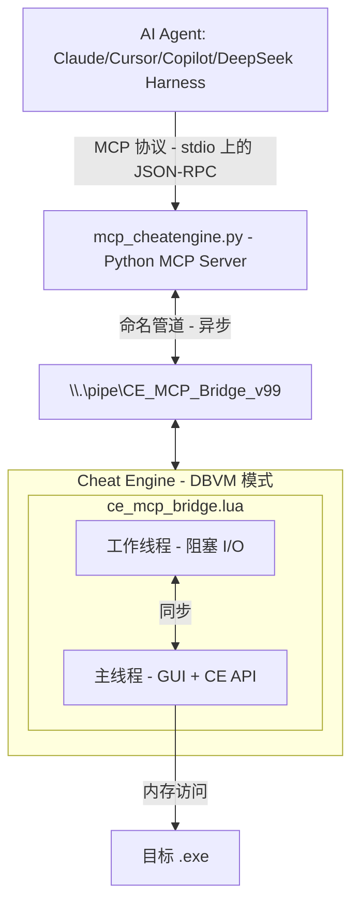

<div align="center">

# Cheat Engine MCP Bridge

**让价值数十亿美元的 AI 数据中心为你分析程序内存。**

[](#) [](https://python.org) [](#deepseek-harness-插件-dsh)

[English](README.md) | **简体中文**

</div>

创建修改器（Mod）、训练器（Trainer）、做安全审计、游戏机器人、加速逆向工程，或者以极短的时间对任意程序与游戏做任何事。

> [!NOTE]
> 感谢所有点赞的朋友，非常感谢！<3
>
> 特别感谢所有贡献者！！
>
> [@libangli218](https://github.com/libangli218), [@lauralex](https://github.com/lauralex), [@iamtyroon](https://github.com/iamtyroon), [@HachiroSan](https://github.com/iamtyroon), [@Attacktive](https://github.com/Attacktive)

---

## 要解决的问题

你面对的是数 GB 的内存、数百万个地址、数千个函数。手工找到*那个指针*、*那个结构体*往往需要**数天甚至数周**。

**如果直接开口问呢？**

> *"找到数据包解密钩子。"*
> *"找到角色坐标的 OPcode。"*
> *"找到血量值的 OPcode。"*
> *"找到独一无二的 AOB 特征码，让我的训练器在游戏更新后依然可靠。"*

**这正是本项目做的事。**

_- 不再逐行翻阅十六进制转储，直接与内存对话。_

---

## 你能得到什么：

| 之前（手工） | 之后（AI Agent + MCP） |
|-----------------|---------------------|
| 第 1 天：找数据包地址 | 第 1 分钟："找到 RX 数据包解密钩子" |
| 第 2 天：追踪谁在写它 | 第 3 分钟："生成唯一 AOB 签名，让它在更新后依然有效" |
| 第 3 天：找 RX 钩子 | 第 6 分钟："找到移动 OPcodes" |
| 第 4 天：整理结构文档 | 第 10 分钟："创建十六进制转文本的 Python 解释器" |
| 第 5 天：游戏更新，从头再来 | **完成。** |

**你的 AI 现在可以：**
- 瞬间读取任意内存（整数、浮点、字符串、指针）
- 追踪指针链：`[[base+0x10]+0x20]+0x8` → 毫秒级解析
- 自动分析结构体（字段类型与值）
- 通过 RTTI 识别 C++ 对象：*"这是一个 CPlayer 对象"*
- 反汇编并分析函数
- 硬件断点 + Ring -1 虚拟化（DBVM）隐形调试
- 以及更多！

---

## 工作原理


---

## 安装

```bash
pip install -r MCP_Server/requirements.txt
```
或手动安装：
```bash
pip install mcp pywin32
```

> [!NOTE]
> 原生命名管道模式**仅支持 Windows**（使用命名管道，依赖 `pywin32`）。当 MCP 服务器运行在承载 Cheat Engine 的 Windows 环境之外、无法直接打开命名管道时，请使用 TCP 中继传输。

---

## DeepSeek Harness 插件（DSH）

本仓库同时是一个 **DeepSeek Harness 插件 bundle**：安装到任意 DSH profile 后，所有 Cheat Engine 能力都会以 `mcp__cheatengine__<工具名>` 命名空间下的原生 DSH 工具出现（例如 `mcp__cheatengine__read_memory`、`mcp__cheatengine__aob_scan_unique`、`mcp__cheatengine__open_process`）。bundle 将仓库自带的 Python MCP 服务器接入 DSH 内置的 MCP 客户端桥接（`@deepseek-ai/dsh-mcp-client`）——**无需配置任何 IDE 的 MCP**。

### 前置条件

- Windows（命名管道传输；需要 `pywin32`）
- Cheat Engine（推荐 7.5+），并**在 Settings → Extra 中禁用 "Query memory region routines"**（DBVM 扫描的硬性要求，见下文"防止蓝屏"）
- Python 3.10+ 及桥接依赖：

```bash
pip install -r MCP_Server/requirements.txt
```

### 安装

在仓库检出目录执行：

```bash
dsh plugin --profile <profile名> add ./DSH-cheatengine-mcp-bridge
```

该命令会创建/更新 profile、链接 bundle 并追加其 patch 层（bundle 与 patch 自动生效，**没有构建步骤**）。

### 1. 在 Cheat Engine 中加载桥接

与其他 MCP 客户端一样：在 Cheat Engine 中 `File → Execute Script` → 打开 `MCP_Server/ce_mcp_bridge.lua` → Execute（或通过 `Table → Show Cheat Table Lua Script` 执行 `dofile`）。成功日志：

```
[MCP v12.0.0] MCP Server Listening on: CE_MCP_Bridge_v99
```

### 2. 附加目标进程

使用 `mcp__cheatengine__open_process`（或 `get_process_list` 工具）附加要分析的进程。在附加进程之前，大多数工具会返回 `{success: false, error_code: "NO_PROCESS"}`。

### 3. 验证

检查合并后的配置：

```bash
dsh --profile <profile名> --dump-config
```

末尾应看到本 bundle 的配置层：

```yaml
# == dsh-cheatengine-mcp-bridge
- id: ce-bridge-paths
  name: dsh-cheatengine-mcp-bridge
- id: mcp-cheatengine
  name: '@deepseek-ai/dsh-mcp-client'
  inject: [ceBridgePaths]
```

profile 启动时会拉起 Python 服务器；DSH 日志会显示 `[MCP CE] Starting FastMCP server (v12/v99 compatible)...` 以及 MCP `ListToolsRequest` 工具发现。若服务器不可达（例如缺少 Python 依赖），mcp-client 行会按退避策略持续重连，profile 仍能正常启动（`failOnStartupError` 默认为 `false`）。

### 配置覆盖

patch 行会被后加的层**整行替换**。如需自定义，请在 profile 自己的 `cordis.patch.yml`（或 `--patch` overlay）中以相同 id 重述整行：

```yaml
# ~/.dsh/cordis.patch.yml（或 --patch overlay）
- update:
    - id: mcp-cheatengine
      config:
        transport: stdio
        serverName: !!js ctx.ceBridgePaths.serverName
        command: !!js ctx.ceBridgePaths.pythonCommand
        args:
          - !!js ctx.ceBridgePaths.serverScript
        env:
          CE_MCP_TRANSPORT: 'pipe'
        toolCallTimeoutMs: 120000
        failOnStartupError: true
        reconnect:
          enabled: true
          initialDelayMs: 500
          maxDelayMs: 30000
          maxAttempts: 10
```

- **Python 解释器**：启动 DSH 前设置 `CE_MCP_PYTHON` 环境变量，或在行中覆盖 `command`。
- **TCP 中继模式**：在 Windows 主机上启动中继（`python MCP_Server/ce_tcp_relay.py --host 127.0.0.1 --port 9876`），然后在行的 `env` 中设置 `CE_MCP_TRANSPORT: tcp`、`CE_MCP_HOST`、`CE_MCP_PORT`。当 DSH 无法直接打开命名管道时使用（WSL、容器、远程主机）。请务必将中继绑定在可信接口上。
- **超时**：`toolCallTimeoutMs` 限制每次工具调用；`CE_MCP_TIMEOUT`（服务器环境变量，默认 30 秒）限制每条 Cheat Engine 命令。
- **Shell 工具**：除非服务器以 `CE_MCP_ALLOW_SHELL=1` 启动，否则 `run_command` / `shell_execute` 保持禁用。

### 卸载

```bash
dsh plugin --profile <profile名> remove dsh-cheatengine-mcp-bridge
```

### 安全提示

该桥接是一套**高权限、主动型工具集**：可以读写任意目标内存、注入 DLL、执行代码、驱动输入/GUI。请仅在你拥有所有权的进程上使用；若使用 TCP 中继，请保持回环/可信接口——任何能触达它的人都等于控制了 Cheat Engine。

---

## 快速开始

### 1. 在 Cheat Engine 中加载桥接
1. 若计划使用 DBVM 工具，先在 Cheat Engine 中启用 DBVM。
2. 打开 Cheat Engine 的 Lua 引擎或脚本执行器。
   - 推荐：`File` -> `Execute Script` -> 打开 `MCP_Server/ce_mcp_bridge.lua` -> `Execute`。
   - 若你的 CE 版本没有 `File` -> `Execute Script`，使用 `Table` -> `Show Cheat Table Lua Script`，粘贴下面的 `dofile(...)` 行并执行：

```lua
dofile([[C:\path\to\cheatengine-mcp-bridge\MCP_Server\ce_mcp_bridge.lua]])
```

寻找日志：`[MCP v12.0.0] MCP Server Listening on: CE_MCP_Bridge_v99`

### 2. 配置 MCP 客户端（IDE 方式）

加入你的 MCP 配置（例如 `mcp_config.json`）：
```json
{
  "servers": {
    "cheatengine": {
      "command": "python",
      "args": ["C:/path/to/MCP_Server/mcp_cheatengine.py"]
    }
  }
}
```
重启 IDE 以加载 MCP 服务器配置。

对于 Codex，在 `~/.codex/config.toml` 中添加 TOML 服务器块：

```toml
[mcp_servers.cheatengine]
command = "python"
args = ['C:\path\to\cheatengine-mcp-bridge\MCP_Server\mcp_cheatengine.py']
```

Windows 路径请使用单引号，这样 TOML 会按字面处理反斜杠。

#### TCP 中继传输

TCP 中继让 `mcp_cheatengine.py` 通过 TCP 套接字与 Cheat Engine 通信，而不是自己打开 Windows 命名管道。Cheat Engine 与 Lua 桥仍运行在 Windows 上，而 MCP 服务器可以运行在任意能触达中继的地方：另一个 Windows 进程、虚拟机、容器、Linux 主机或远程机器。也可用于 WSL 而无需改动 Lua 桥。

1. 在 Windows 上照常加载 `MCP_Server/ce_mcp_bridge.lua`。
2. 在 Windows 上启动中继：

```powershell
python C:\path\to\cheatengine-mcp-bridge\MCP_Server\ce_tcp_relay.py --host 127.0.0.1 --port 9876
```

3. 在 MCP 服务器运行的环境中，安装不含 `pywin32` 的 MCP 依赖，然后以 TCP 传输方式运行/配置 MCP 服务器：

```bash
python3 -m pip install -r MCP_Server/requirements-tcp.txt
```

```bash
CE_MCP_TRANSPORT=tcp \
CE_MCP_HOST=127.0.0.1 \
CE_MCP_PORT=9876 \
python3 /path/to/cheatengine-mcp-bridge/MCP_Server/mcp_cheatengine.py
```

支持环境变量的 MCP 客户端配置：

```json
{
  "servers": {
    "cheatengine": {
      "command": "python3",
      "args": ["/path/to/cheatengine-mcp-bridge/MCP_Server/mcp_cheatengine.py"],
      "env": {
        "CE_MCP_TRANSPORT": "tcp",
        "CE_MCP_HOST": "127.0.0.1",
        "CE_MCP_PORT": "9876"
      }
    }
  }
}
```

根据你的网络环境设置中继的 `--host` 与 MCP 服务器的 `CE_MCP_HOST`。请仅将中继绑定到可信接口，因为任何能触达它的人都可控制 Cheat Engine 桥接。

### 3. 验证连接
使用 `ping` 工具验证连通性：
```json
{"success": true, "version": "12.0.0", "message": "CE MCP Bridge Active"}
```

### 4. 开始提问
```
"当前附加的是哪个进程？"
"读取基址处的 16 个字节"
"反汇编入口点"
```

---

## 约 180 个 MCP 工具

### 内存
| 工具 | 说明 |
|------|-------------|
| `read_memory`, `read_integer`, `read_string` | 读取任意数据类型 |
| `read_pointer_chain` | 追踪 `[[base+0x10]+0x20]` 路径 |
| `scan_all`, `aob_scan` | 查找数值与字节模式 |

### 分析
| 工具 | 说明 |
|------|-------------|
| `disassemble`, `analyze_function` | 代码分析 |
| `dissect_structure` | 自动识别字段与类型 |
| `get_rtti_classname` | 识别 C++ 对象类型 |
| `find_references`, `find_call_references` | 交叉引用 |

### 调试
| 工具 | 说明 |
|------|-------------|
| `set_breakpoint`, `set_data_breakpoint` | 硬件断点 |
| `start_dbvm_watch` | Ring -1 隐形追踪 |

### 进程生命周期
| 工具 | 说明 |
|------|-------------|
| `open_process`, `get_process_list` | 附加或枚举运行中的进程 |
| `create_process` | 在 CE 控制下启动新进程 |
| `pause_process`, `unpause_process` | 挂起 / 恢复目标执行 |

### 内存分配
| 工具 | 说明 |
|------|-------------|
| `allocate_memory`, `free_memory` | 在目标中保留和释放内存 |
| `set_memory_protection`, `full_access` | 调整页保护标志 |

### 代码注入
| 工具 | 说明 |
|------|-------------|
| `inject_dll` | 向目标进程加载 DLL |
| `execute_code`, `execute_method` | 远程运行 shellcode 或 CE Lua 方法 |

### 符号管理
| 工具 | 说明 |
|------|-------------|
| `register_symbol`, `get_symbol_info` | 创建和查询命名符号 |
| `enable_windows_symbols` | 启用 PDB 符号解析 |

### 汇编 / 编译
| 工具 | 说明 |
|------|-------------|
| `assemble_instruction` | 将单条 x86/x64 指令汇编为字节 |
| `compile_c_code` | 将 C 源码编译为可注入的 shellcode |
| `generate_api_hook_script` | 生成 CE 自动汇编 API 钩子模板 |

### 窗口 / GUI 自动化
| 工具 | 说明 |
|------|-------------|
| `find_window` | 按标题或类名定位窗口 |
| `send_window_message` | 向目标窗口发送 `WM_*` 消息 |

### 输入自动化
| 工具 | 说明 |
|------|-------------|
| `get_pixel` | 采样屏幕坐标处的像素颜色 |
| `is_key_pressed`, `do_key_press` | 查询和模拟键盘输入 |

### 作弊表（Cheat Table）
| 工具 | 说明 |
|------|-------------|
| `load_table`, `save_table` | 加载 / 保存 `.CT` 作弊表文件 |
| `get_address_list` | 枚举活动作弊表中的条目 |

### 内核模式（DBK / DBVM）
| 工具 | 说明 |
|------|-------------|
| `dbk_get_cr3` | 读取目标进程的 CR3 寄存器 |
| `read_process_memory_cr3` | 通过 CR3 旁路读取物理内存 |

完整清单见 `AI_Context/MCP_Bridge_Command_Reference.md`

---

## 关键配置

### 防止蓝屏
> [!CAUTION]
> **你必须禁用：** Cheat Engine → Settings → Extra → **"Query memory region routines"**
>
> 若开启：扫描受保护页面时会因与 DBVM/反作弊冲突导致 `CLOCK_WATCHDOG_TIMEOUT` 蓝屏。

---

## 故障排查

### Cheat Engine 提示 "too many local variables"

使用 `dofile(...)` 从磁盘加载桥接，而不要将完整脚本粘贴进作弊表脚本。桥接有意将命令处理器声明为全局函数，以避免整个桥接一次性编译时触发 CE 的 200 个局部变量上限。

### MCP 客户端无法连接

依次检查：

1. Cheat Engine 已打开并显示 `MCP Server Listening on: CE_MCP_Bridge_v99`。
2. 添加服务器配置后已重启 MCP 客户端。
3. 配置的 `mcp_cheatengine.py` 路径存在。
4. `pip install -r MCP_Server/requirements.txt` 已安装 `mcp` 和 `pywin32`。
5. 运行 MCP `ping` 工具。成功连接返回 `success: true` 与桥接版本。在 Cheat Engine 附加目标进程前 `process_id: 0` 是正常现象。

---

## 环境变量

| 变量 | 默认值 | 用途 |
|----------|---------|---------|
| `CE_MCP_TIMEOUT` | `30` | 每次 MCP 工具调用的超时时间（秒）。 |
| `CE_MCP_ALLOW_SHELL` | *未设置* | 设为 `1` 启用 `run_command` / `shell_execute` 工具。**任意代码执行风险**——默认请勿设置。 |

---

## 示例工作流

**查找一个数值：**
```
你: "扫描金币: 15000"  →  AI 找到 47 个结果
你: "金币变成 15100 了"  →  AI 过滤到 3 个地址
你: "谁在写第一个地址？"  →  AI 设置硬件断点
你: "反汇编那个函数"  →  完整的 AddGold 逻辑呈现
```

**理解一个结构体：**
```
你: "[[game.exe+0x1234]+0x10] 里是什么？"
AI: "RTTI: CPlayerInventory"
AI: "0x00=vtable, 0x08=itemCount(int), 0x10=itemArray(ptr)..."
```

---

## 项目结构

```
CLAUDE.md                               # Claude Code agent 指南（本仓库）
README.md                               # 面向用户的文档（英文）
README.zh.md                            # 面向用户的文档（简体中文）

MCP_Server/
├── mcp_cheatengine.py                  # Python MCP 服务器（FastMCP）
├── ce_mcp_bridge.lua                   # Cheat Engine Lua 桥接
└── test_mcp.py                         # 测试套件

AI_Context/
├── BATCH_WORKER_BRIEFING.md            # 并行工作者的任务规范（v12 重构）
├── MCP_Bridge_Command_Reference.md     # MCP 命令参考
├── CE_LUA_Documentation.md             # CheatEngine 7.6 官方完整文档
└── AI_Guide_MCP_Server_Implementation.md  # 面向 AI agent 的完整技术文档
```

---

## 测试

运行测试：
```bash
python MCP_Server/test_mcp.py
```

预期输出：
```
✅ Memory Reading: 6/6 tests passed
✅ Process Info: 4/4 tests passed  
✅ Code Analysis: 8/8 tests passed
✅ Breakpoints: 4/4 tests passed
✅ DBVM Functions: 3/3 tests passed
✅ Utility Commands: 11/11 tests passed
⏭️ Skipped: 1 test (generate_signature)
────────────────────────────────────
Total: 36/37 PASSED (100% success)
```

---

## 结语

你不再需要成为专家。只要问对问题。

⚠️ 教育免责声明

本代码仅用于教育和研究目的，用于展示模型上下文协议（MCP）与基于 LLM 的调试能力。我不支持将这些工具用于恶意黑客行为、多人游戏作弊或违反服务条款。这是软件工程自动化的一次演示。
